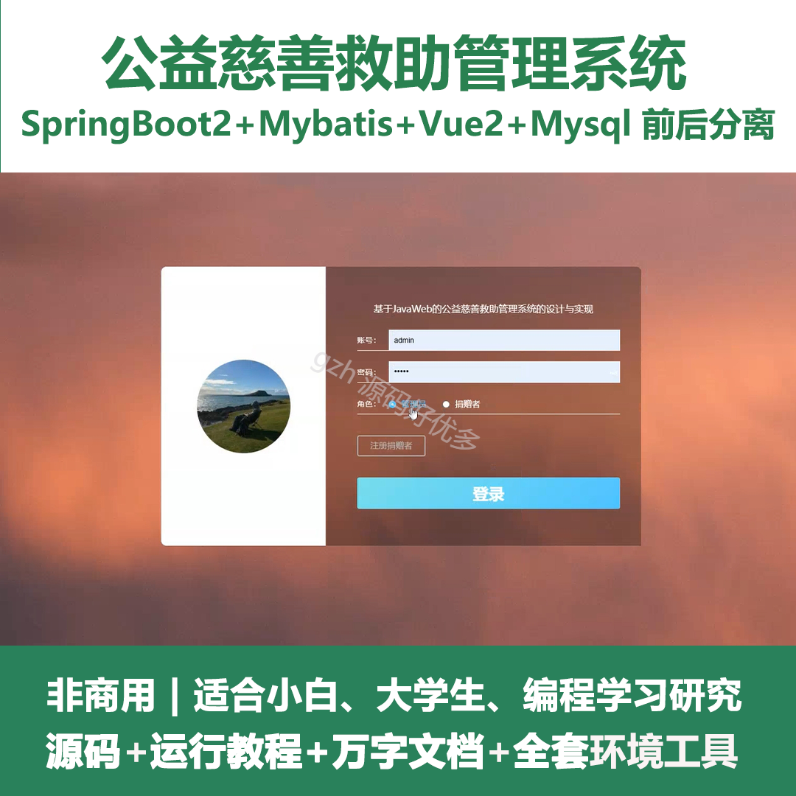
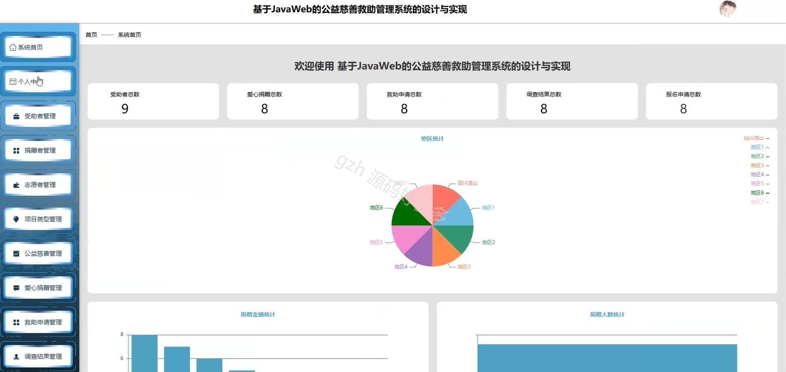
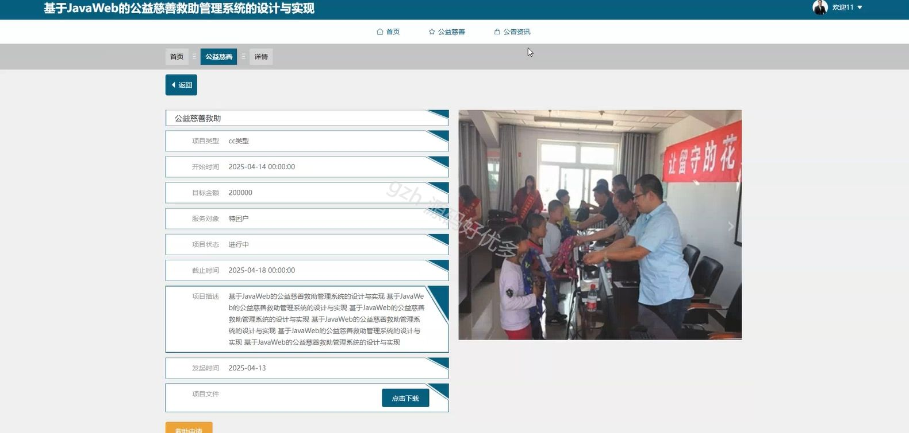
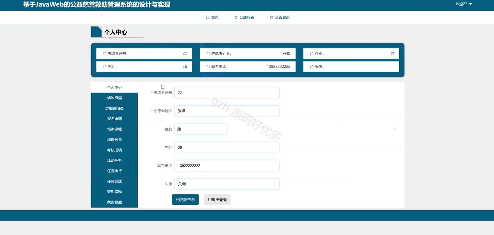
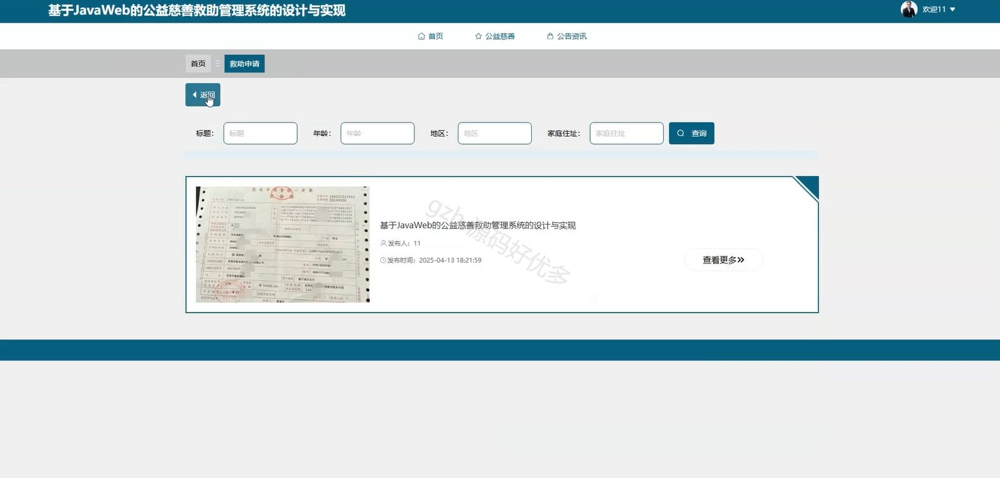
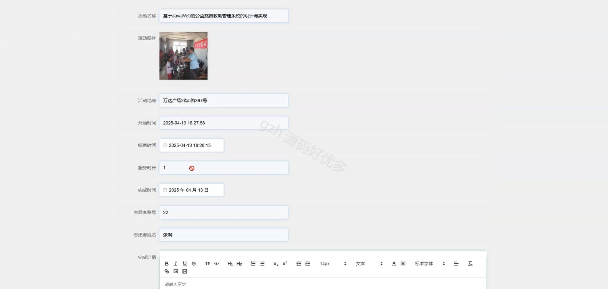
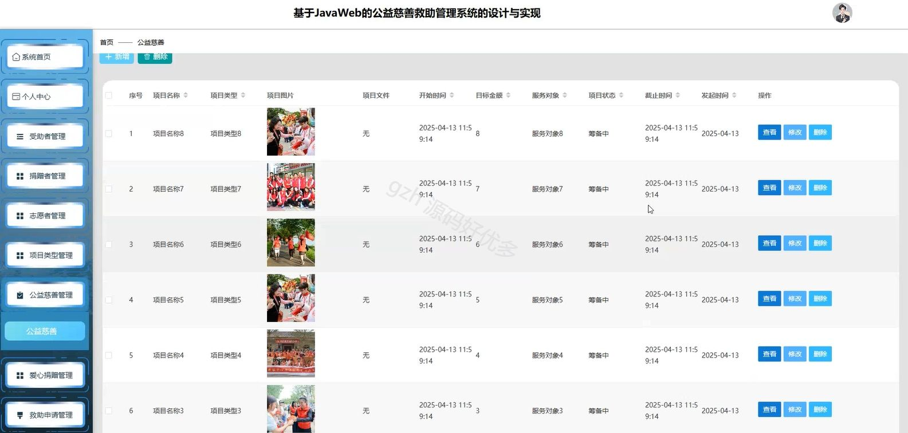
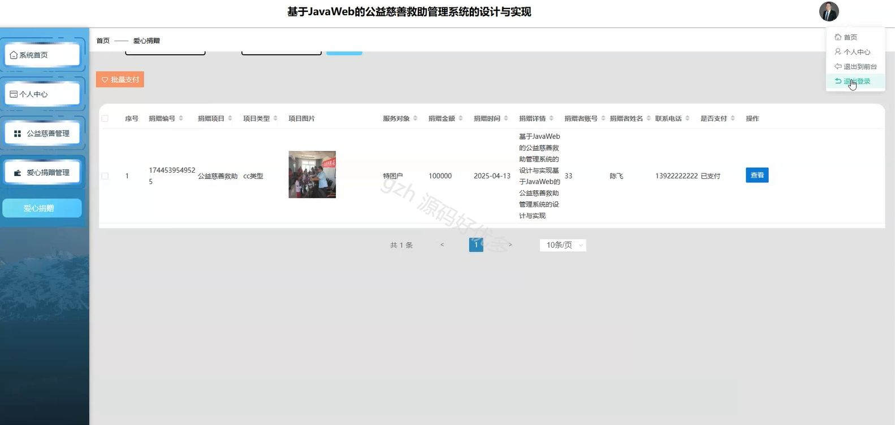
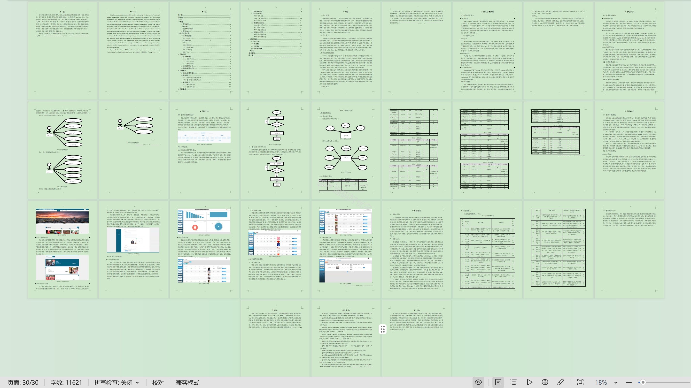

# springbootA391D
springbootA391D基于JavaWeb的公益慈善救助管理系统
## 查看主页获取源码

### 一、关键词

爱心捐赠、救助申请、志愿者招募

 

### 二、作品包含

源码+数据库+设计文档万字+全套环境和工具资源+部署教程

 

### 三、项目技术

前端技术：Html、Css、Js、Vue2.0、Element-ui 
后端技术：Java、SpringBoot2.0、MyBatis

  

 

### 四、运行环境（以下版本亲测，其他版本未知，请自测）

开发工具：IDEA/eclipse  + VSCODE

数据库：MySQL5.7（最低要5.7版本）

数据库管理工具：Navicat10以上版本

环境配置软件： JDK1.8 + Maven3.6.3

前端Nodejs：14

浏览器：谷歌浏览器

 

### 五、项目介绍

项目编号：springbootA391D

基于 JavaWeb 的公益慈善救助管理系统能够整合救助信息，助力公益慈善救助工作高效、规范、公开地开展。

角色：管理员、受助者、志愿者、捐赠者

受助者功能：首页、公益慈善、公告资讯、个人中心、修改密码、救助申请、调查结果、反馈申诉、我的收藏。

志愿者功能：首页、公益慈善、公告资讯、个人中心、修改密码、志愿者招募、报名申请、培训课程、培训报名、考核成绩、活动任务、任务执行、任务完成、表彰奖励、我的收藏。

管理员功能：系统首页、个人中心、受助者管理、捐赠者管理、志愿者管理、项目类型管理、公益慈善管理、爱心捐赠管理、救助申请管理、调查结果管理、反馈申诉管理、志愿者招募管理、报名申请管理、培训课程管理、培训报名管理、考核成绩管理、活动任务管理、任务执行管理、任务完成管理、表彰奖励管理、系统管理。

捐赠者功能：系统首页、个人中心、公益慈善管理、爱心捐赠管理。

 

### 六、运行截图

